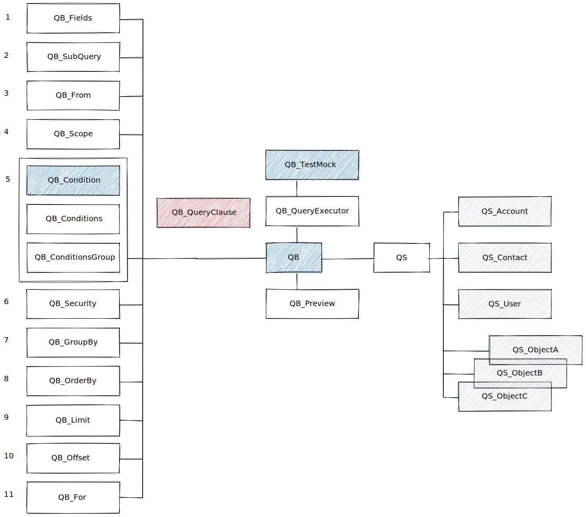

# Query Selector (QS) - Query Builder (QB)

Dynamic SOQL refers to the creation of a SOQL string at run time with Apex code. Dynamic SOQL enables you to create more flexible applications. For example, you can create a search based on input from an end user or update records with varying field names.

## Architecture

Framework has two connected parts
- Query Builder (`QB`) - Allows to build dynamic SOQL
- Query Selector (`QS`) - Uses `QB` to build dynamic SOQL and get results


### Query Builder (QB)

Allows to build dynamic SQOL.

Query Builder (QB) framework uses [Composite](https://refactoring.guru/design-patterns/composite) and [Builder](https://refactoring.guru/design-patterns/builder) patterns.

Each query clause (`SELECT`, `FROM`, `WHERE`, `LIMIT`) is represented by concrete Apex Class (Single Responsibility Principle).

| Index | Statement         | Apex Class                                            |
| ----- | ----------------- | ----------------------------------------------------- |
| 1     | SELECT            | `QB_Fields`                                           |
| 2     | subQuery          | `QB_SubQuery`                                         |
| 3     | FROM              | `QB_From`                                             |
| 4     | USING SCOPE       | `QB_Scope`                                            |
| 5     | WHERE             | `QB_ConditionsGroup`, `QB_Conditions`, `QB_Condition` |
| 6     | SECURITY_ENFORCED | `QB_WithSecurityEnforced`                             |
| 7     | GROUP BY          | `QB_GroupBy`                                          |
| 8     | ORDER BY          | `QB_OrderBy`                                          |
| 9     | LIMIT             | `QB_Limit`                                            |
| 10    | OFFSET            | `QB_Offset`                                           |
| 11    | FOR               | `QB_For`                                              |


All classes mentioned above + `QB.cls` extends `QB_QueryClause` abstract class.

```java
public abstract class QB_QueryClause {

    public abstract String build();

    public virtual String validate() {
        return '';
    }
}
```

Classes needs to implement `build()` method that return SOQL part.
`validate()` can be use to provide additional validation that will be executed during build phase.

Developer should based on:
- `QB.cls` - to build SOQL.
- `QB_Condition` - to prepare condition.
- `QB_TestMock` - to mock query result in unit tests.

```java
new QB(sObjectType)
    // Fields
    .withFields(List<sObjectField> fields)
    .withRelatedFields(String commaSeparatedFieldsNames)
    // SubQuery
    .withSubQuery(QB subQueryBuilder)
    .withSubQueries(List<QB> subQueryBuilders)
    // Scope
    .withDelegatedScope()
    .withMineScope()
    .withMineAndMyGroupsScope()
    .withMyTerritoryScope()
    .withMyTeamTerritoryScope()
    .withTeamScope()
    // Where
    .withWhere(QB_Condition queryCondition)
    .withWhere(List<QB_Condition> queryConditions)
    .withWhere(List<QB_Condition> queryConditions, String conditionOrder)
    .withWhere(QB_Conditions queryConditions)
    .withWhere(QB_ConditionsGroup queryConditionsBuilder)
    // Security
    .withoutSecurityEnforced() // WITH SECURITY ENFORCED by default
    .withoutSharing() // cxecuted with sharing by default
    // Group By
    .withGroupBy(sObjectField field)
    .withGroupBy(List<sObjectField> fields)
    // Order By
    .withAscOrder(sObjectField field)
    .withAscOrder(String field)
    .withDescOrder(sObjectField field)
    .withDescOrder(String field)
    // Limit
    .withLimit(Integer soqlLimit)
    // Offset
    .withOffset(Integer soqlOffset)
    // For
    .withForReference()
    .withForView()
    .withForUpdate()
    .withAllRows()
    // Mocking - Allow mocking in unit tests
    .withMocking(String queryIdentifier)
    // Execute
    .toSObjectList()
    .toSObject()
```

### Query Selector (QS)

Query Builder is middle class between `QB.cls` and concrete selectors.
QS contains default methods that can be used by new selectors.

SObject Selectors should extends `QS` class, and implements the following methods:
- `getById(Id recordId)`
- `getByIds(List<Id> recordIds)`
- `toObject()`
- `toList()`

**NOTE** Methods implementation **CANNOT** be forced by interface/abstract method, because methods return instances of concrete object so developer do not need to cast it.

### Conditions

Conditions are handled by the following classes:
 - `QB_Condition.cls`
 - `QB_Conditions.cls`
 - `QB_ConditionsGroup.cls`

Why three classes?
It allows build conditions in dynamic way e.g. passing `QB_Conditions` or `QB_ConditionsGroup` instance between method and add more conditions.

Developer should would interact mostly with `QB_Condition`

```java
new QB_Condition(Schema.SObjectField field)
new QB_Condition(String fieldName)

```


## Usage

```java
Contact myContact = new QS_Contact()
                        .withField(new List<sObjectField>{ Contact.Id, Contact.FirstName, Contact.LastName })
                        .toWhere(new QB_Condition(Contact.Name).equal('Contact1'))
                        .toObject();
```

## Benefits

### SOQL Errors handling

No *List has no rows for assignment to SObject* error. When record not found value will be set to null.

```java
Contact myContact = [SELECT Id, Name FROM Contact WHERE Name = 'invalidName'];
// Error: List has no rows for assignment to SObject

Contact myContact = new QS_Contact()
                        .withFields(new List<sObjectField>{ Contact.Id, Contact.Name })
                        .withWhere(new QB_Condition(Contact.Name).equal('invalidName'))
                        .toObject();
// null
```

### Easy to debug

### External objects mocking

External objects cannot be insert during the test. Selectors provide easy way to mock the data.

### One place to manage all SOQLs

## TODO

- [ ] SOQL Query Performance sugestion
- [ ] QB_TestMock
- [ ] Custom Metadata for debugging on production
- [ ] Skip condition when null (?)
- [ ] Enforce CRUD
- [ ] Relationship name as a String, fields as sObjectFields

## License notes

- For proper license management each repository should contain LICENSE file similar to this one.
- each original class should contain copyright mark: © Copyright 2022, Beyond The Cloud Dev Authors
