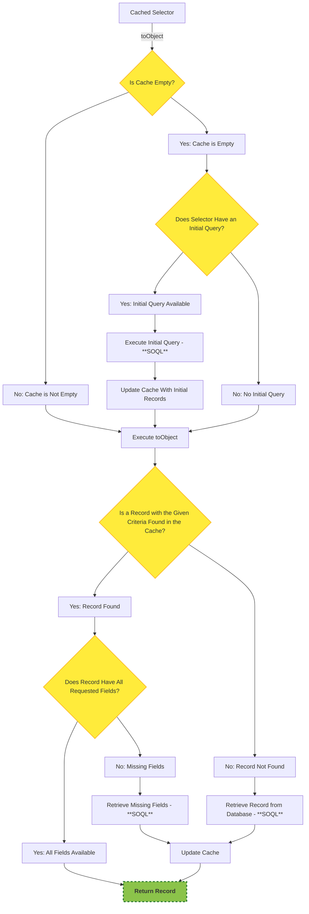

# Caching

SOQL caching is more complex than it seems. From our perspective, it is much more important to make the code predictable, bug-proof, and intuitive rather than adding numerous features that could confuse developers.

To achieve our goals, we made the following assumptions:

## Limited Interface

The Cached SOQL Selector should have a limited interface that represents only the operations that can be performed on cached records. Methods that exist in the SOQL Library are not relevant when retrieving cached records. For example, it is impossible to check sharing rules for cached records, so methods like `withSharing()` or `withoutSharing()` are not applicable.

For instance, the following query:

```apex
SOQL.of(Profile.SObjectType)
    .with(Profile.Id, Profile.Name, Profile.UserType)
    .myTerritoryScope()
    .forView()
    .withSharing()
    .toList();
```

doesn’t make sense when working with cached records. We cannot apply scope, forView, or withSharing to cached records.

From the very beginning, we envisioned the cache SOQL as a standalone module, not logic tightly coupled with the SOQL Library. Each company could potentially have its own caching system. Therefore, we decided to introduce a new module called `SOQLCache.cls`.

```apex
public interface Cacheable {
    // CONFIG
    Cacheable cacheInApexTransaction();
    Cacheable cacheInOrgCache();
    Cacheable cacheInSessionCache();
    // SELECT
    Cacheable with(SObjectField field);
    Cacheable with(SObjectField field1, SObjectField field2);
    Cacheable with(SObjectField field1, SObjectField field2, SObjectField field3);
    Cacheable with(SObjectField field1, SObjectField field2, SObjectField field3, SObjectField field4);
    Cacheable with(SObjectField field1, SObjectField field2, SObjectField field3, SObjectField field4, SObjectField field5);
    Cacheable with(List<SObjectField> fields);
    Cacheable with(String fields);
    // WHERE
    Cacheable whereEqual(SObjectField field, Object value);
    Cacheable whereEqual(String field, Object value);
    // FIELD-LEVEL SECURITY
    Cacheable stripInaccessible();
    Cacheable stripInaccessible(AccessType accessType);
    // MOCKING
    Cacheable mockId(String queryIdentifier);
    // DEBUGGING
    Cacheable preview();
    // PREDEFINED
    Cacheable byId(SObject record);
    Cacheable byId(Id recordId);
    // RESULT
    Id toId();
    Boolean doExist();
    SObject toObject();
    Object toValueOf(SObjectField fieldToExtract);
}
```

## Cached Selectors

To avoid interfering with existing selectors and to keep the logic clean and simple, the best approach we identified is using Cached Selectors.

This approach provides immediate feedback to developers reading the code, indicating that the following query is cached. For instance:
`SOQL_Profile.query().byName('System Administrator').toObject();` retrieves records from the database, whereas
`SOQL_ProfileCache.query().byName('System Administrator').toObject();` retrieves records from the cache.

This clear distinction gives architects full control over which records should be cached and which should not, addressing potential issues that might arise with a `.saveInCache()` method.

Additionally, Cached Selectors look slightly different and include cache-specific methods:

```apex
public with sharing class SOQL_ProfileCache extends SOQLCache implements SOQLCache.Selector {
    public static SOQL_ProfileCache query() {
        return new SOQL_ProfileCache();
    }

    private SOQL_ProfileCache() {
        super(Profile.SObjectType);
        cacheInOrgCache();
        with(Profile.Id, Profile.Name, Profile.UserType);
    }

    public override SOQL.Queryable initialQuery() {
        return SOQL.of(Profile.SObjectType).systemMode().withoutSharing();
    }

    public SOQL_ProfileCache byName(String profileName) {
        whereEqual(Profile.Name, profileName);
        return thisl
    }
}
```

Developers can specify the type of storage using the `cacheIn...()` method. The available storage types are: Apex Transaction (`cacheInApexTransaction()`), Org Cache (`cacheInOrgCache()`), or Session Cache (`cacheInSessionCache()`).

Additionally, the `with(...)` method provides information about which fields are cached in the specified storage.

Last but not least, there is the `initialQuery()` method, which allows records to be prepopulated in the storage. For example, `SOQL_ProfileCache` will prepopulate all `Profiles` in the storage, so calling `byName(String profileName)` will not execute a query but will retrieve the records directly from the cache.

## Records are stored as a List

Records are stored in the cache as a `List`, with the cache key being the `SObjectType`. This approach helps avoid record duplication, which is crucial given the limited storage capacity.

Key: `Profile`

Records:

| Id | Name | UserType |
| -- | ---- | -------- |
| 00e3V000000DhteQAC | Standard Guest | Guest |
| 00e3V000000DhtfQAC | Community Profile | Guest |
| 00e3V000000NmefQAC | Standard User | Standard |
| 00e3V000000Nme3QAC | System Administrator | Standard |
| 00e3V000000NmeAQAS | Standard Platform User | Standard |
| 00e3V000000NmeHQAS | Customer Community Plus User | PowerCustomerSuccess |
| 00e3V000000NmeNQAS | Customer Community Plus Login User | PowerCustomerSuccess |

**Why not just cache by SOQL String?**

`SELECT Id, Name FROM Profile` => List of Profiles.

There are several reasons why caching by SOQL string is not the best approach:

1. **Identical Queries Treated Differently**

Even the same SOQL query can be treated as different due to variations in the string format.
For instance, `SELECT Id, Name FROM Profile` and `SELECT Name, Id FROM Profile` are identical in intent but differ in query string format. This issue becomes even more complex when dealing with `WHERE` conditions.

2. **Duplicate Entries and Inefficient Record Retrieval**

A simple query like `SELECT Id, Name FROM Profile` is a subset of a more complex query like `SELECT Id, Name, UserType FROM Profile`.
If the results of `SELECT Id, Name, UserType FROM Profile` are already cached, the simpler query should ideally retrieve the relevant data from the cache. However, if the cache uses the query string as the key, this won’t work, leading to duplication and inefficiency.

3. **Cache Storage Limitations**

Cache storage is limited. If different variations of queries continually add new entries to the cache, it can quickly fill up with redundant or overlapping records, reducing overall effectiveness.

4. **Condition binding**

The SOQL library uses variable binding ([`queryWithBinds`](https://developer.salesforce.com/docs/atlas.en-us.apexref.meta/apexref/apex_methods_system_database.htm#apex_System_Database_queryWithBinds)). Using the query as a key becomes highly complex when there are many binding variables. Developers aim to use cached records to boost performance, but relying on the query as a key can be performance-intensive and counterproductive.

## Cached query required single condition

A query requires a single condition, and that condition must filter by a unique field.

To ensure that cached records are aligned with the database, a single condition is required.
A query without a condition cannot guarantee that the number of records in the cache matches the database.

For example, let’s assume a developer makes the query: `SELECT Id, Name FROM Profile`. Cached records will be returned, but they may differ from the records in the database.

The filter field should be unique. Consistency issues can arise when the field is not unique. For instance, the query:
`SELECT Id, Name FROM Profile WHERE UserType = 'Standard'`
may return some records, but the number of records in the cache may differ from those in the database.

Using a unique field ensures that if a record is not found in the cache, the SOQL library can look it up in the database.

**Example**

**Cached Records:**

| Id               | Name                          | UserType               |
|-------------------|-------------------------------|------------------------|
| 00e3V000000Nme3QAC | System Administrator          | Standard               |
| 00e3V000000NmeAQAS | Standard Platform User        | Standard               |
| 00e3V000000NmeHQAS | Customer Community Plus User | PowerCustomerSuccess   |

**Database Records:**

| Id               | Name                          | UserType               |
|-------------------|-------------------------------|------------------------|
| 00e3V000000Nme3QAC | System Administrator          | Standard               |
| 00e3V000000NmeAQAS | Standard Platform User        | Standard               |
| 00e3V000000NmeZQAS | Read Only                    | Standard               |
| 00e3V000000NmeYQAS | Solution Manager             | Standard               |
| 00e3V000000NmeHQAS | Customer Community Plus User | PowerCustomerSuccess   |

Let’s assume a developer executes the query:
`SELECT Id, Name, UserType FROM Profile WHERE UserType = 'Standard'`.

Since records exist in the cache, 2 records will be returned, which is incorrect. The database contains 4 records with `UserType = 'Standard'`.
To avoid such scenarios, filtering by a unique field is required.

Sometimes, certain limitations can ensure that code functions in a deterministic and expected way. From our perspective, it is better to have limitations that make the code free from bugs and prevent unintended misuse.

## Only one record can be returned

With a cached selector, you **cannot** invoke the `toList()` method—only `toObject()` is supported. As mentioned at the beginning, SOQL Lib is designed to be bug-proof. The `toList()` method could cause confusion because the number of retrieved records may differ from the number of records in the database. This limitation is also tied to the unique field filter, which ensures that only one record is returned.

Additionally, the single-record assumption keeps the code clean and bug-proof. If a record matching the provided condition does not exist in the cache, SOQL is executed, and the record is added to the cache. This approach would be impossible to implement if multiple records were allowed in the cache, as it would be unclear whether any records are missing.

## Cached queries run in System Mode

**NOTE!**

All queries (both initial and actual) used in a cached selector are executed in `WITH SYSTEM_MODE` and `without sharing`, regardless of any other settings.

**Why is that?**

It is impossible to verify if a user has access to records (`sharing`) when using cached records. To avoid confusion, we decided to execute all cached queries in system mode. Developers can still enforce field-level security by invoking `stripInaccessible()` method.

## How it works?



There are a few scenarios where SOQL will be issued:

1. The cache is empty, and an initial query is provided.
2. The record is not found in the cache.
3. The record is found in the cache but does not have all the requested fields.
