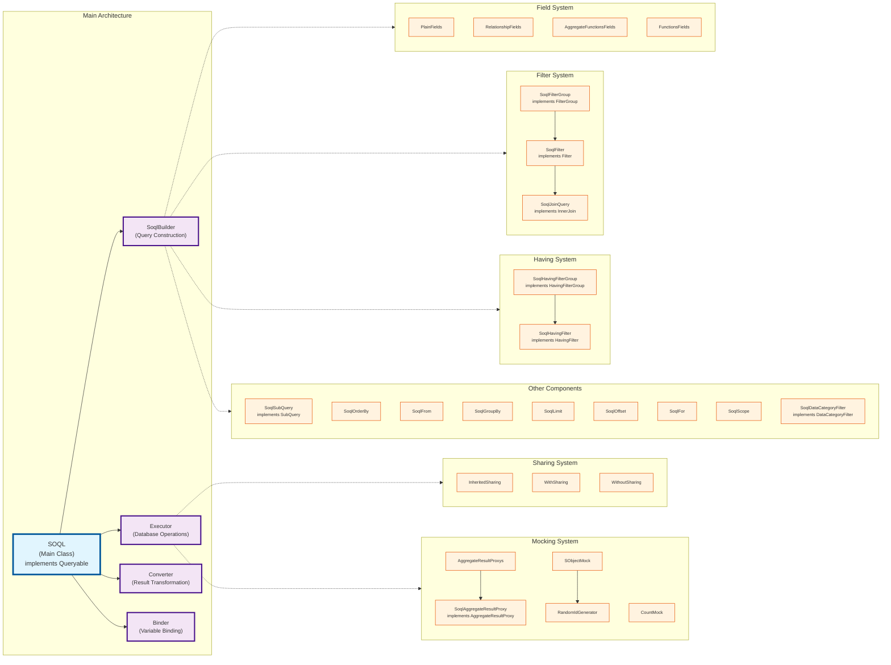

# Design

## Single class

SOQL Lib is a single-class solution.

You don't need to think about dependencies; everything you need is stored in [SOQL.cls](https://github.com/beyond-the-cloud-dev/soql-lib/blob/main/force-app/main/default/classes/main/standard-soql/SOQL.cls). The `SOQL.cls` contains only around 3000 lines of code.

Different clauses are encapsulated in small, inner classes.
All crucial information is kept at the top of the class, so developers can use it even without reading the documentation.

## Class Architecture

The following diagram shows the internal structure and relationships between the main classes and interfaces in SOQL Lib:

## Core Architecture



## Public API

### Static Factory Methods
- [`SOQL.FilterGroup`](/api/standard-soql/soql-filters-group) → creates FilterGroup
- [`SOQL.Filter`](/api/standard-soql/soql-filter) → creates Filter  
- [`SOQL.HavingFilterGroup`](/api/standard-soql/soql-having-filter-group) → creates HavingFilterGroup
- [`SOQL.HavingFilter`](/api/standard-soql/soql-having-filter) → creates HavingFilter
- [`SOQL.SubQuery`](/api/standard-soql/soql-sub) → creates SubQuery
- [`SOQL.InnerJoin`](/api/standard-soql/soql-join) → creates InnerJoin
- [`SOQL.DataCategoryFilter`](/api/standard-soql/soql-data-category-filter) → creates DataCategoryFilter

### Public Interfaces
- `Queryable` - Main query interface
- `FilterGroup` - Filter grouping
- `Filter` - Individual filters
- `HavingFilterGroup` - Having clause grouping  
- `HavingFilter` - Having clause filters
- `SubQuery` - Subquery operations
- `InnerJoin` - Join operations
- `DataCategoryFilter` - Data category filtering
- `Mockable` - Mocking interface
- `AggregateResultProxy` - Aggregate result handling

```apex
    public interface Selector {
        Queryable query();
    }

    public interface Queryable {
        // SELECT
        Queryable with(SObjectField field);
        Queryable with(SObjectField field1, SObjectField field2);
        Queryable with(SObjectField field1, SObjectField field2, SObjectField field3);
        Queryable with(SObjectField field1, SObjectField field2, SObjectField field3, SObjectField field4);
        Queryable with(SObjectField field1, SObjectField field2, SObjectField field3, SObjectField field4, SObjectField field5);
        Queryable with(List<SObjectField> fields);
        Queryable with(Iterable<String> fields);
        Queryable with(String fields);
        Queryable with(SObjectField field, String alias);
        Queryable with(String relationshipName, SObjectField field);
        Queryable with(String relationshipName, SObjectField field1, SObjectField field2);
        Queryable with(String relationshipName, SObjectField field1, SObjectField field2, SObjectField field3);
        Queryable with(String relationshipName, SObjectField field1, SObjectField field2, SObjectField field3, SObjectField field4);
        Queryable with(String relationshipName, SObjectField field1, SObjectField field2, SObjectField field3, SObjectField field4, SObjectField field5);
        Queryable with(String relationshipName, Iterable<SObjectField> fields);
        Queryable with(SubQuery subQuery);
        Queryable withFieldSet(String fieldSetName);
        // SELECT - AGGREGATE FUNCTIONS
        Queryable count();
        Queryable count(SObjectField field);
        Queryable count(SObjectField field, String alias);
        Queryable count(String relationshipName, SObjectField field);
        Queryable count(String relationshipName, SObjectField field, String alias);
        Queryable avg(SObjectField field);
        Queryable avg(SObjectField field, String alias);
        Queryable avg(String relationshipName, SObjectField field);
        Queryable avg(String relationshipName, SObjectField field, String alias);
        Queryable countDistinct(SObjectField field);
        Queryable countDistinct(SObjectField field, String alias);
        Queryable countDistinct(String relationshipName, SObjectField field);
        Queryable countDistinct(String relationshipName, SObjectField field, String alias);
        Queryable min(SObjectField field);
        Queryable min(SObjectField field, String alias);
        Queryable min(String relationshipName, SObjectField field);
        Queryable min(String relationshipName, SObjectField field, String alias);
        Queryable max(SObjectField field);
        Queryable max(SObjectField field, String alias);
        Queryable max(String relationshipName, SObjectField field);
        Queryable max(String relationshipName, SObjectField field, String alias);
        Queryable sum(SObjectField field);
        Queryable sum(SObjectField field, String alias);
        Queryable sum(String relationshipName, SObjectField field);
        Queryable sum(String relationshipName, SObjectField field, String alias);
        // SELECT - GROUPING
        Queryable grouping(SObjectField field, String alias);
        // SELECT - toLabel
        Queryable toLabel(SObjectField field);
        Queryable toLabel(SObjectField field, String alias);
        Queryable toLabel(String field);
        Queryable toLabel(String field, String alias);
        // SELECT - FORMAT
        Queryable format(SObjectField field);
        Queryable format(SObjectField field, String alias);
        // USING SCOPE
        Queryable delegatedScope();
        Queryable mineScope();
        Queryable mineAndMyGroupsScope();
        Queryable myTerritoryScope();
        Queryable myTeamTerritoryScope();
        Queryable teamScope();
        // WHERE
        Queryable whereAre(FilterGroup filterGroup);
        Queryable whereAre(Filter filter);
        Queryable whereAre(String conditions);
        Queryable conditionLogic(String order);
        Queryable anyConditionMatching();
        // GROUP BY
        Queryable groupBy(SObjectField field);
        Queryable groupBy(String field);
        Queryable groupBy(String relationshipName, SObjectField field);
        Queryable groupByRollup(SObjectField field);
        Queryable groupByRollup(String relationshipName, SObjectField field);
        Queryable groupByCube(SObjectField field);
        Queryable groupByCube(String relationshipName, SObjectField field);
        // HAVING
        Queryable have(HavingFilterGroup havingFilterGroup);
        Queryable have(HavingFilter havingFilter);
        Queryable have(String havingConditions);
        Queryable havingConditionLogic(String havingConditionsOrder);
        Queryable anyHavingConditionMatching();
        // WITH DATA CATEGORY
        Queryable withDataCategory(DataCategoryFilter dataCategoryFilter);
        // ORDER BY
        Queryable orderBy(SObjectField field);
        Queryable orderBy(String field);
        Queryable orderBy(String field, String direction);
        Queryable orderBy(String relationshipName, SObjectField field);
        Queryable orderByCount(SObjectField field);
        Queryable sortDesc();
        Queryable sort(String direction);
        Queryable nullsLast();
        // LIMIT
        Queryable setLimit(Integer amount);
        // OFFSET
        Queryable offset(Integer startingRow);
        // FOR
        Queryable forReference();
        Queryable forView();
        Queryable forUpdate();
        Queryable allRows();
        // FIELD-LEVEL SECURITY
        Queryable userMode();
        Queryable systemMode();
        Queryable stripInaccessible();
        Queryable stripInaccessible(AccessType accessType);
        // SHARING MODE
        Queryable withSharing();
        Queryable withoutSharing();
        // MOCKING
        Queryable mockId(String queryIdentifier);
        // DEBUGGING
        Queryable preview();
        Map<String, Object> binding();
        // PREDEFINIED
        Queryable byId(SObject record);
        Queryable byId(Id recordId);
        Queryable byIds(Iterable<Id> recordIds);
        Queryable byIds(List<SObject> records);
        Queryable byRecordType(String recordTypeDeveloperName);
        // RESULT
        Id toId();
        Boolean doExist();
        String toString();
        Object toValueOf(SObjectField fieldToExtract);
        Set<String> toValuesOf(SObjectField fieldToExtract);
        Set<String> toValuesOf(String relationshipName, SObjectField targetKeyField);
        Integer toInteger();
        SObject toObject();
        List<SObject> toList();
        List<AggregateResult> toAggregated();
        List<SOQL.AggregateResultProxy> toAggregatedProxy();
        Map<Id, SObject> toMap();
        Map<String, SObject> toMap(SObjectField keyField);
        Map<String, SObject> toMap(String relationshipName, SObjectField targetKeyField);
        Map<String, String> toMap(SObjectField keyField, SObjectField valueField);
        Map<String, List<SObject>> toAggregatedMap(SObjectField keyField);
        Map<String, List<SObject>> toAggregatedMap(String relationshipName, SObjectField targetKeyField);
        Map<String, List<String>> toAggregatedMap(SObjectField keyField, SObjectField valueField);
        Database.QueryLocator toQueryLocator();
    }

    public interface SubQuery {
        SubQuery of(String ofObject);
        // SELECT
        SubQuery with(SObjectField field);
        SubQuery with(SObjectField field1, SObjectField field2);
        SubQuery with(SObjectField field1, SObjectField field2, SObjectField field3);
        SubQuery with(SObjectField field1, SObjectField field2, SObjectField field3, SObjectField field4);
        SubQuery with(SObjectField field1, SObjectField field2, SObjectField field3, SObjectField field4, SObjectField field5);
        SubQuery with(Iterable<SObjectField> fields);
        SubQuery with(String fields);
        SubQuery with(String relationshipName, Iterable<SObjectField> fields);
        SubQuery with(SubQuery subQuery);
        // WHERE
        SubQuery whereAre(FilterGroup filterGroup);
        SubQuery whereAre(Filter filter);
        // ORDER BY
        SubQuery orderBy(SObjectField field);
        SubQuery orderBy(String field);
        SubQuery orderBy(String relationshipName, SObjectField field);
        SubQuery sortDesc();
        SubQuery sort(String direction);
        SubQuery nullsLast();
        // LIMIT
        SubQuery setLimit(Integer amount);
        // OFFSET
        SubQuery offset(Integer startingRow);
        // FOR
        SubQuery forReference();
        SubQuery forView();
    }

    public interface FilterGroup {
        // ADD CONDITION
        FilterGroup add(FilterGroup filterGroup);
        FilterGroup add(Filter filter);
        FilterGroup add(String dynamicCondition);
        FilterGroup add(List<Filter> filters);
        FilterGroup add(List<String> dynamicConditions);
        // ORDER
        FilterGroup anyConditionMatching();
        FilterGroup conditionLogic(String order);
        // ADDITIONAL
        FilterGroup ignoreWhen(Boolean logicExpression);

        Boolean hasValues();
    }

    public interface Filter {
        // FIELDS
        Filter id();
        Filter recordType();
        Filter name();
        Filter with(SObjectField field);
        Filter with(String field);
        Filter with(String relationshipName, SObjectField field);
        // COMPERATORS
        Filter isNull();
        Filter isNotNull();
        Filter isTrue();
        Filter isFalse();
        Filter equal(Object value);
        Filter notEqual(Object value);
        Filter lessThan(Object value);
        Filter lessOrEqual(Object value);
        Filter greaterThan(Object value);
        Filter greaterOrEqual(Object value);
        Filter containsSome(Iterable<String> values);
        Filter contains(String value);
        Filter contains(String prefix, String value, String suffix);
        Filter notContains(String value);
        Filter notContains(String prefix, String value, String suffix);
        Filter endsWith(String value);
        Filter notEndsWith(String value);
        Filter startsWith(String value);
        Filter notStartsWith(String value);
        Filter isIn(Iterable<Object> iterable);
        Filter isIn(InnerJoin joinQuery);
        Filter notIn(Iterable<Object> iterable);
        Filter notIn(InnerJoin joinQuery);
        Filter includesAll(Iterable<String> values);
        Filter includesSome(Iterable<String> values);
        Filter excludesAll(Iterable<String> values);
        Filter excludesSome(Iterable<String> values);
        // ADDITIONAL
        Filter asDateLiteral();
        Filter ignoreWhen(Boolean logicExpression);

        Boolean hasValue();
    }

    public interface InnerJoin {
        InnerJoin of(SObjectType ofObject);
        // SELECT
        InnerJoin with(SObjectField field);
        // WHERE
        InnerJoin whereAre(FilterGroup filterGroup);
        InnerJoin whereAre(Filter filter);
    }

    public interface HavingFilterGroup {
        // ADD CONDITION
        HavingFilterGroup add(HavingFilterGroup havingFilterGroup);
        HavingFilterGroup add(HavingFilter havingFilter);
        HavingFilterGroup add(String dynamicHaving);
        // ORDER
        HavingFilterGroup anyConditionMatching();
        HavingFilterGroup conditionLogic(String order);

        Boolean hasValues();
    }

    public interface HavingFilter {
        // FIELDS
        HavingFilter with(SObjectField field);
        HavingFilter with(String field);
        HavingFilter count(SObjectField field);
        HavingFilter avg(SObjectField field);
        HavingFilter countDistinct(SObjectField field);
        HavingFilter min(SObjectField field);
        HavingFilter max(SObjectField field);
        HavingFilter sum(SObjectField field);
        // COMPERATORS
        HavingFilter isNull();
        HavingFilter isNotNull();
        HavingFilter isTrue();
        HavingFilter isFalse();
        HavingFilter equal(Object value);
        HavingFilter notEqual(Object value);
        HavingFilter lessThan(Object value);
        HavingFilter lessOrEqual(Object value);
        HavingFilter greaterThan(Object value);
        HavingFilter greaterOrEqual(Object value);
        HavingFilter contains(String value);
        HavingFilter contains(String prefix, String value, String suffix);
        HavingFilter notContains(String value);
        HavingFilter notContains(String prefix, String value, String suffix);
        HavingFilter startsWith(String value);
        HavingFilter notStartsWith(String value);
        HavingFilter endsWith(String value);
        HavingFilter notEndsWith(String value);
        HavingFilter isIn(Iterable<Object> iterable);
        HavingFilter notIn(Iterable<Object> iterable);

        Boolean hasValue();
    }

    public interface DataCategoryFilterGroup {
        DataCategoryFilterGroup add(DataCategoryFilter dataCategoryFilter);
    }

    public interface DataCategoryFilter {
        // FIELDS
        DataCategoryFilter with(String field);
        // COMPERATORS
        DataCategoryFilter at(String category);
        DataCategoryFilter at(Iterable<String> categories);
        DataCategoryFilter above(String category);
        DataCategoryFilter above(Iterable<String> categories);
        DataCategoryFilter below(String category);
        DataCategoryFilter below(Iterable<String> categories);
        DataCategoryFilter aboveOrBelow(String category);
        DataCategoryFilter aboveOrBelow(Iterable<String> categories);

        Boolean hasValue();
    }

    public interface AggregateResultProxy {
        Object get(String field);
        Map<String, Object> getPopulatedFieldsAsMap();
    }

    public static SubQuery SubQuery {
        get { return new SoqlSubQuery(); }
    }

    public static FilterGroup FilterGroup {
        get { return new SoqlFilterGroup(); }
    }

    public static Filter Filter {
        get { return new SoqlFilter(); }
    }

    public static InnerJoin InnerJoin {
        get { return new SoqlJoinQuery(); }
    }

    public static HavingFilterGroup HavingFilterGroup {
        get { return new SoqlHavingFilterGroup(); }
    }

    public static HavingFilter HavingFilter {
        get { return new SoqlHavingFilter(); }
    }

    public static DataCategoryFilter DataCategoryFilter {
        get { return new SoqlDataCategoryFilter(); }
    }

    public static SOQL of(SObjectType ofObject) {
        return new SOQL(ofObject);
    }

    public static SOQL of(String ofObject) {
        return new SOQL(ofObject);
    }

    // Mocking

    @TestVisible
    private static Mockable mock(String mockId) {
        queryIdToMock.put(mockId, new SoqlMock());
        return queryIdToMock.get(mockId);
    }

    @TestVisible
    private static RandomIdGenerator IdGenerator = new RandomIdGenerator();

    public interface Mockable {
        // SObject
        Mockable thenReturn(SObject record);
        Mockable thenReturn(List<SObject> records);
        // AggregateResultProxy
        Mockable thenReturn(List<Map<String, Object>> aggregatedResults);
        Mockable thenReturn(Map<String, Object> aggregatedResult);
        // Count
        Mockable thenReturn(Integer count);
    }
```

## Functional Programming

SOQL Lib uses the concept called [Apex Functional Programming](https://github.com/ipavlic/apex-fp).

You can see an example of it with `SOQL.SubQuery`, `SOQL.FilterGroup`, `SOQL.Filter` and `SOQL.InnerJoin`.
Those classes encapsulate the logic, and only necessary methods are exposed via interfaces.

```apex
Queryable whereAre(FilterGroup filterGroup); // SOQL.FilterGroup
Queryable whereAre(Filter filter); // SOQL.Filter
```

```apex
SOQL.of(Account.SObjectType)
     .with(Account.Id, Account.Name);
     .whereAre(SOQL.FilterGroup
        .add(SOQL.Filter.with(Account.Id).equal(accountId))
        .add(SOQL.Filter.with(Account.Name).contains(accountName))
        .anyConditionMatching() // OR
      )
     .toList();
```

## Return Concrete SOQL instance

```apex
public inherited sharing class SOQL_Account extends SOQL implements SOQL.Selector {
    public static SOQL_Account query() {
        return new SOQL_Account();
    }

    private SOQL_Account() {
        super(Account.SObjectType);
        // default settings
        with(Account.Name, Account.AccountNumber)
            .systemMode();
    }

    public SOQL_Account byIndustry(String industry) {
        with(Account.Industry)
            .whereAre(Filter.with(Account.Industry).equal(industry));
        return this;
    }
}
```

As you can see, the method `byIndustry(String industry)` returns an instance of `SOQL_Account` instead of `List<SObject>` or `Object`. Why is that? You can adjust the query to your needs and add more SOQL clauses without duplicating the code.

```apex
SOQL_Account.query()
    .byIndustry('IT')
    .orderBy(Account.Name)
    .toList();
```
